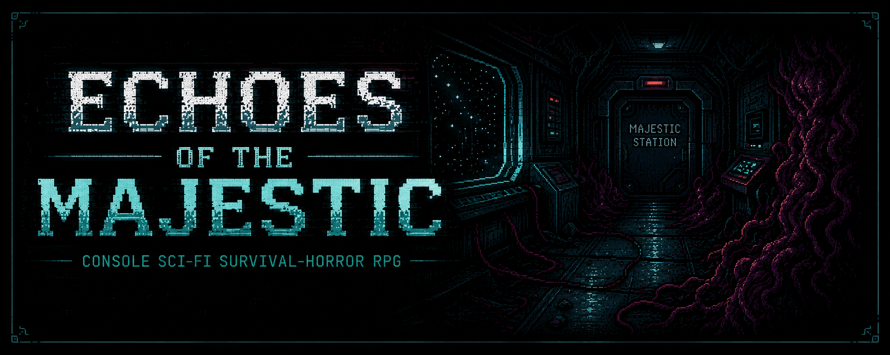
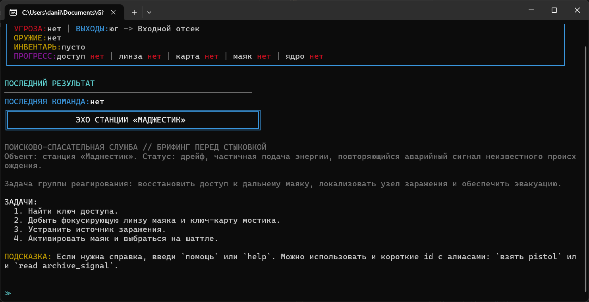
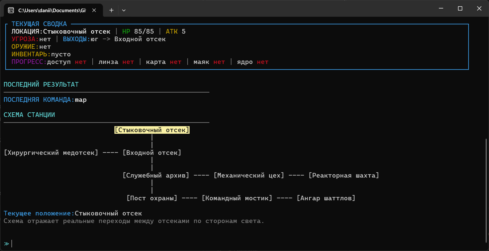
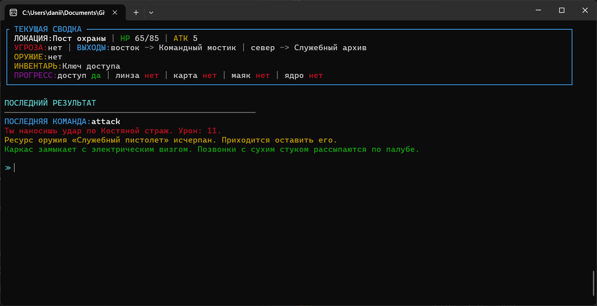

Echoes of the Majestic is a console sci-fi survival-horror RPG written in C++.
The player boards a drifting station, explores connected compartments, fights the infestation called the Growth, restores a long-range beacon, and tries to escape alive.

## Project Overview

- Genre: text RPG / survival-horror
- Platform: Windows console
- Language: C++17
- Localization: currently available in Russian only
- Interface: terminal UI with ANSI colors
- Data-driven content: locations, items, enemies, logs, and most UI text are stored in `data/*.txt`

## Main Features

- exploration of a small station map with connected rooms
- combat with several enemy types
- quest items and win-condition progression
- collectible logs that reveal the station's backstory
- ASCII station map with current-location highlight
- standalone release build with a reserve built-in copy of all text data

## Screenshots







## Project Structure

- `src/Core` - game loop, command handling, combat, progression, view-model construction
- `src/UI` - console rendering, decorations, map output
- `src/Data` - loading text assets and fallback to embedded data
- `include/Entities` - game entities: player, item, location, rival, log entry
- `data` - editable game content and text assets
- `docs` - architecture diagrams and supporting documentation

## Build

### CMake Presets

The presets in `CMakePresets.json` use the `NMake Makefiles` generator, so they
must be run from a Visual Studio Developer Command Prompt (or from a shell
where the MSVC build environment has already been initialized).

Debug:

```powershell
cmake --preset debug
cmake --build --preset build-debug
```

Release:

```powershell
cmake --preset release
cmake --build --preset build-release
```

If `cmake` is not in `PATH`, either:

- open the project in Visual Studio, or
- run the commands from the Visual Studio Developer Command Prompt, where both
  `cmake` and the MSVC toolchain are available.

## Run

Debug build:

```powershell
.\out\debug\majestic_station.exe
```

Release build:

```powershell
.\out\release\majestic_station.exe
```

The release build can also work as a standalone `.exe` because the project generates a built-in reserve copy of the text data during compilation.

## Command Logging

Debug builds always write a command log next to the executable.

Release builds write a log only when launched with:

```powershell
.\majestic_station.exe --log-commands
```

The log file is created next to the `.exe`:

```text
majestic_station_commands.log
```

## Main Commands

- `идти [направление]`
- `взять [предмет]`
- `использовать [предмет]`
- `читать [лог]`
- `атаковать`
- `осмотреть [цель]`
- `смотреть`
- `инвентарь`
- `статус`
- `цель`
- `карта`
- `помощь`

English aliases are also supported: `go`, `take`, `use`, `read`, `attack`, `inspect`, `look`, `map`, `help`.
